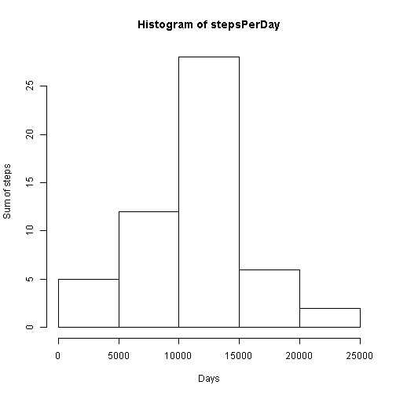
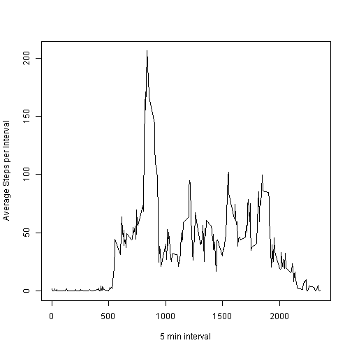
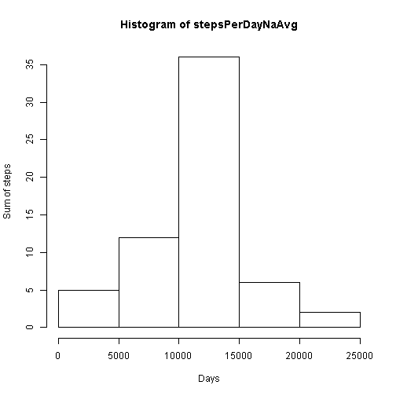
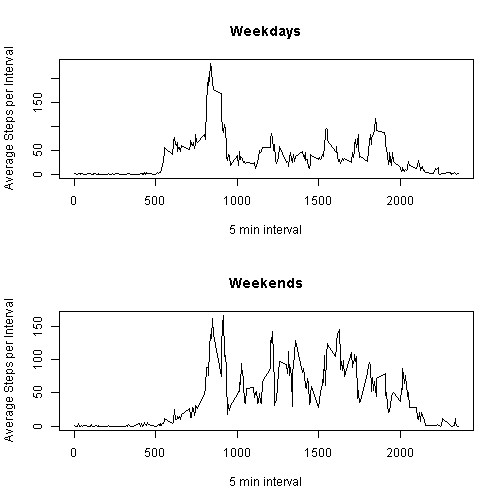

## Loading and preprocessing the data
I've cloned the git repository https://github.com/rdpeng/RepData_PeerAssessment1 in the commit   80edf39c3bb508fee88e3394542f967dd3fd3270 with the data and instructions for this assignment.    
This cloned repository contains the data that I used in this assignment, it's a zip file called activity.zip that  
has inside a csv file called activity.csv, the following code extracts the activity.csv file from activity.zip.

```r
unzip("activity.zip")
```

I read the csv file to R and observed it's dimensions and summary


```r
activityDf <- read.csv("activity.csv")
dim(activityDf)
```

```
## [1] 17568     3
```

```r
summary(activityDf)
```

```
##      steps                date          interval     
##  Min.   :  0.00   2012-10-01:  288   Min.   :   0.0  
##  1st Qu.:  0.00   2012-10-02:  288   1st Qu.: 588.8  
##  Median :  0.00   2012-10-03:  288   Median :1177.5  
##  Mean   : 37.38   2012-10-04:  288   Mean   :1177.5  
##  3rd Qu.: 12.00   2012-10-05:  288   3rd Qu.:1766.2  
##  Max.   :806.00   2012-10-06:  288   Max.   :2355.0  
##  NA's   :2304     (Other)   :15840
```


## What is mean total number of steps taken per day?
Here I just ignored the missing values in the dataset, for that I created a new data.frame just with entries without NAs:  

```r
activityDfNoNa <- activityDf[!is.na(activityDf$steps), ]
```
Then I've made some work with the data without NAs.

```r
totalSteps <- sum(activityDfNoNa$steps)
totalDays <- length(levels(activityDf$date))
```
The indivitual of this experiment has taken 570608 steps during the 61 days that he was wearing his personal activity monitoring device.

I've calculated the sum of steps per day ignoring the days that have NA values, generated a histogram and calculated its mean and median:

```r
stepsPerDay <- tapply(activityDfNoNa$steps, activityDfNoNa$date, FUN = sum)
stepsPerDay <- stepsPerDay[!is.na(stepsPerDay)]
stepsPerDayMeanRaw <- mean(stepsPerDay)
stepsPerDayMean <- format(round(stepsPerDayMeanRaw, 2), nsmall = 2)
stepsPerDayMedianRaw <- median(stepsPerDay)
stepsPerDayMedian <- format(round(stepsPerDayMedianRaw, 2), nsmall = 2)
hist(stepsPerDay, ylab = "Sum of steps", xlab = "Days")
```

 


The mean of steps per day here is 10766.19 and the median is 10765.00

## What is the average daily activity pattern?
The get a view about the time interval patterns, I've calculated the average of steps during each time interval.  
You can see below the results of that with a time series plot:

```r
avgStepsPerInterval <- tapply(activityDfNoNa$steps, activityDfNoNa$interval, FUN = mean)
plot(y=avgStepsPerInterval, x= rownames(avgStepsPerInterval),type = "l", ylab = "Average Steps per Interval", xlab="5 min interval")
```

 

I've calculated the interval with the highest average of steps as well:

```r
maxAvgStepsPerInterval <- max(avgStepsPerInterval)
maxAvgStepsIntervalName <- names(avgStepsPerInterval[avgStepsPerInterval == maxAvgStepsPerInterval])
maxAvgStepsPerIntervalFormatted <- format(round(maxAvgStepsPerInterval, 2), nsmall = 2)
```
The interval with the biggest average of steps per day is 835 with an average of 206.17 steps


## Imputing missing values
This data set came with some missing values for steps, bellow I've calculated how many rows have missing values on this data set:

```r
sapply(activityDf, function(x) sum(is.na(x)))
```

```
##    steps     date interval 
##     2304        0        0
```

To fill in those missing values, I chose the general mean of that 5 minute interval.

```r
activityDfNaAvg <- data.frame()
for (index in 1:nrow(activityDf))  { 
  row <- activityDf[index,]
  if(is.na(row["steps"])) {
    row["steps"] <- avgStepsPerInterval[as.integer(names(avgStepsPerInterval)) == as.integer(row["interval"])]
  }
  activityDfNaAvg <- rbind(activityDfNaAvg, row)
}
```
With those missing values replaced, to compare with the one with NAs removed, I've calculated the mean and the median of total number of steps per day.  
I ploted an histogram as well:

```r
stepsPerDayNaAvg <- tapply(activityDfNaAvg$steps, activityDfNaAvg$date, FUN = sum)
stepsPerDayNaAvgMeanRaw <- mean(stepsPerDayNaAvg)
stepsPerDayMeanDiff <- stepsPerDayMeanRaw - stepsPerDayNaAvgMeanRaw
stepsPerDayNaAvgMedianRaw <- median(stepsPerDayNaAvg)
stepsPerDayMedianDiff <- stepsPerDayMedianRaw - stepsPerDayNaAvgMedianRaw
hist(stepsPerDayNaAvg, ylab = "Sum of steps", xlab = "Days")
```

 
The histogram do not seems to differ from the later histogram with the missing data ommited.  
About the difference in mean and the median, mean of NA removed - NA replaced is 0 and median  of NA removed - NA replaced is -1.1886792


## Are there differences in activity patterns between weekdays and weekends?
I've created a factor variable in the dataset to separate weekdays from weekends in the Na processd data frame.

```r
weekend <- c("Saturday", "Sunday")
activityDfNaAvg$weekdays <- as.factor(
                              ifelse(weekdays(as.Date(activityDfNaAvg$date)) %in% weekend, "weekend", "weekday")
                            )
```
I made a panel plot to compare weekdays with weekends

```r
activityDfWeek <- activityDfNaAvg[activityDfNaAvg$weekdays == "weekday" ,]
activityDfWeekend <- activityDfNaAvg[activityDfNaAvg$weekdays == "weekend" ,]

avgStepsWeek <- tapply(activityDfWeek$steps, activityDfWeek$interval, FUN = mean)
avgStepsWeekend <- tapply(activityDfWeekend$steps, activityDfWeekend$interval, FUN = mean)
layout(matrix(1:2, ncol = 1))
plot(y=avgStepsWeek, x= rownames(avgStepsWeek),type = "l", ylab = "Average Steps per Interval", xlab="5 min interval", main = "Weekdays")

plot(y=avgStepsWeekend, x= rownames(avgStepsWeekend),type = "l", ylab = "Average Steps per Interval", xlab="5 min interval", main = "Weekends")
```

 
